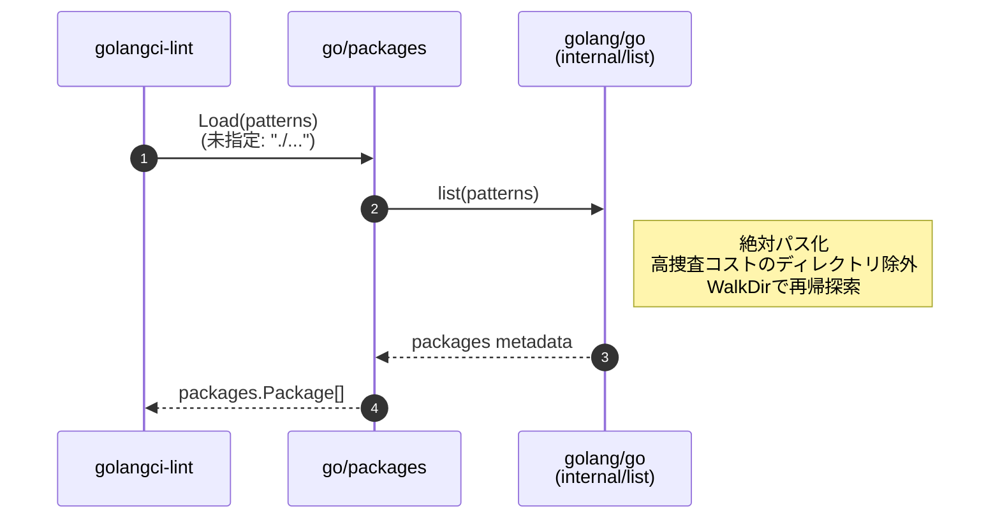

ソフトウェアエンジニアの [hata](https://x.com/sho_hata_) です。
これは[Go Advent Calendar 2025](https://qiita.com/advent-calendar/2025/go)、[カンムアドベントカレンダー2025](https://adventar.org/calendars/12074)の記事です。

golangci-lint や go vet などの静的解析ツールでは、`./...` 引数（package pattern）を指定すると、現在のディレクトリ以下のすべてのパッケージを対象に静的解析を行うことができます。

```bash
golangci-lint run ./...
```

この「./...」がどのように実装されているか気になったので、実装を追ってみました。また、自作のCliツールに「./...」引数を追加し、同様の機能を実現したいとき、どのように実装すれば良いかも紹介します。

## 結論

自作のCliツールに「./...」引数を追加したい場合は、golang.org/x/tools/go/packagesパッケージの Load 関数を使います。

https://github.com/golang/tools/blob/44ce4e29b97fffa0f365922daa86c6bb6a23eb68/go/packages/packages.go#L261

この Load 関数では、内部で捜査対象のパスが有効なGoパッケージを含む可能性のある場所かどうかチェックし、捜査コストが高い場所は除外しています。例えば /var や /etc などの巨大なディレクトリツリーを渡してしまって捜査に時間がかかるといったケースを防いでいます。

使い方としては、以下のようになります。

```go
pkgs, err := packages.Load(conf, args...)
if err != nil {
    return nil, fmt.Errorf("failed to load with go/packages: %w", err)
}
```

引数の`args`に「./...」を渡すことで、返り値の pkgs に引数で指定したパッケージが`package.Package`型で格納されます。あとは、この`package.Package`型のスライスを使って、静的解析やコード生成などの構文木処理を行うことができます。

## golangci-lint や go vet ではどのようにして「./...」をサポートしているのか

ここからは、golangci-lint や go vet ではどのようにして「./...」をサポートしているのかを追ってみます。
golangci-lint を例とします。

### 全体像



### golangci-lint/pkg/lint/package.go

run コマンドが実行されると、引数として渡されたパス（`./...`）が`PackageLoader.args`に入ります。

https://github.com/golangci/golangci-lint/blob/main/pkg/lint/package.go#L82

`args`は、相対パスで表現された文字列のスライスとなっています。

```bash
golangci-lint run dir1 dir2/...
```

↓

```text
[]string{"./dir1", "./dir2/..."}
```

引数が指定されていない場合は「`./...`」が入ります。

```bash
golangci-lint run
```

↓

```text
[]string{"./..."}
```

そしてこの文字列のスライスを、`golang.org/x/tools/go/packages` の `Load`関数に渡し、パッケージ情報（ファイル操作対象のファイル内容含む）を取得しています。

まだここでは「`./...`」の解釈は行っていません。

### golang.org/x/tools/go/packages

https://github.com/golang/tools/blob/44ce4e29b97fffa0f365922daa86c6bb6a23eb68/go/packages/packages.go#L261

`go/packages`は、パターンの解釈を直接行っていません。  
パターンは`DriverRequest`を通じて外部ドライバー（通常は`go list`ベースのドライバー）にパターンを委譲しています。

最終的に、ドライバーから取得した生のパッケージ情報を `Package` オブジェクトに変換・最適化しています。

https://github.com/golang/tools/blob/44ce4e29b97fffa0f365922daa86c6bb6a23eb68/go/packages/packages.go#L773

### golang/go
#### `./...`解釈のメイン処理

https://github.com/golang/go/blob/4ab1aec0/src/cmd/go/internal/modload/load.go#L533

```go
dir := filepath.Dir(filepath.Clean(m.Pattern()[:i+3]))  
absDir := dir  
if !filepath.IsAbs(dir) {  
    absDir = filepath.Join(base.Cwd(), dir)  
}
```

「`...`」の前の部分からディレクトリパスを抽出し、絶対パスに変換しています。

例えば、`./foo/...` というパターンの場合、`./foo` が抽出され、カレントディレクトリと結合されて絶対パスになります。

#### 走査範囲が適当かチェック

絶対パスの位置が、以下のいずれかに含まれているか（=有効なGoパッケージを含む可能性のある場所か）どうかチェックします。

* 標準ライブラリ
* メインモジュール
* 依存モジュール

https://github.com/golang/go/blob/4ab1aec0/src/cmd/go/internal/modload/load.go#L546

たとえば、`/var` や `/etc` のような巨大なディレクトリツリーで走査すると、非常にコストが高くなってしまいます。

仮に`golangci-lint run ../../../../`を実行したとしても、巨大なディレクトリツリーを走査し、処理に時間がかかることを防いでいます。

#### src/cmd/go/internal/fsys/walk.go でディレクトリツリーを再帰的に走査

検証が成功した場合、`MatchDirs()`にて、`fsys.WalkDir()` を使ってディレクトリツリーを再帰的に走査します。

https://github.com/golang/go/blob/4ab1aec00799f91e96182cbbffd1de405cd52e93/src/cmd/go/internal/fsys/walk.go#L15

処理内容は、filepath パッケージの Walk 関数と同様です。

この処理では、さらに効率的な走査をするために以下のディレクトリをskipします。

* `.` や `_` で始まるディレクトリ
* `testdata` ディレクトリ
* `vendor` ディレクトリ（特定の条件下）

--------------------------------
最終的に、 `packages.Load` 関数に渡されたパターンにマッチするパッケージ情報が `Package` オブジェクトに変換・最適化されて返されます。

## おわりに

Go でよく使われる 「./...」のパターンが、内部でどう解釈・展開されているのかを追ってみました。

ディレクトリ走査や AST 操作を伴うツールで 「./...」 をサポートしたい場合、走査処理を自作するよりも golang.org/x/tools/go/packages の Load を使うのが安全です。巨大なディレクトリツリーを意図せず全部捜査してしまう、といった事故を避けやすくなります。

ただし、ここまで紹介した 「./...」 対応テクニックは 多くの場合そこまで出番はありません。静的解析ツールであれば analysis パッケージを使って実装し、go vet の仕組みに乗せるのが定石です。go vet 側がここで紹介した仕組みと同じ形で「パッケージ名 → 対象ソースの解決」をやってくれるので、ツール自身が 「./...」 を解釈する必要がなくなります。

```bash
go vet -vettool=`which mylinter` ./...
```

一方で、go vet のエコシステムに乗らない用途、たとえば AST を直接書き換える系のニッチなツールでは、ここで紹介したパターン展開の知見が役立つことがあります。

実際、私は AST を扱う[自作ツール](https://github.com/sho-hata/tparagen)を作っていますが、ディレクトリ操作を自前実装しているため不要な走査が発生しうる状態です。今後は go/packages.Load を使う形に寄せて、無駄な走査を避ける実装にしていく予定です。
